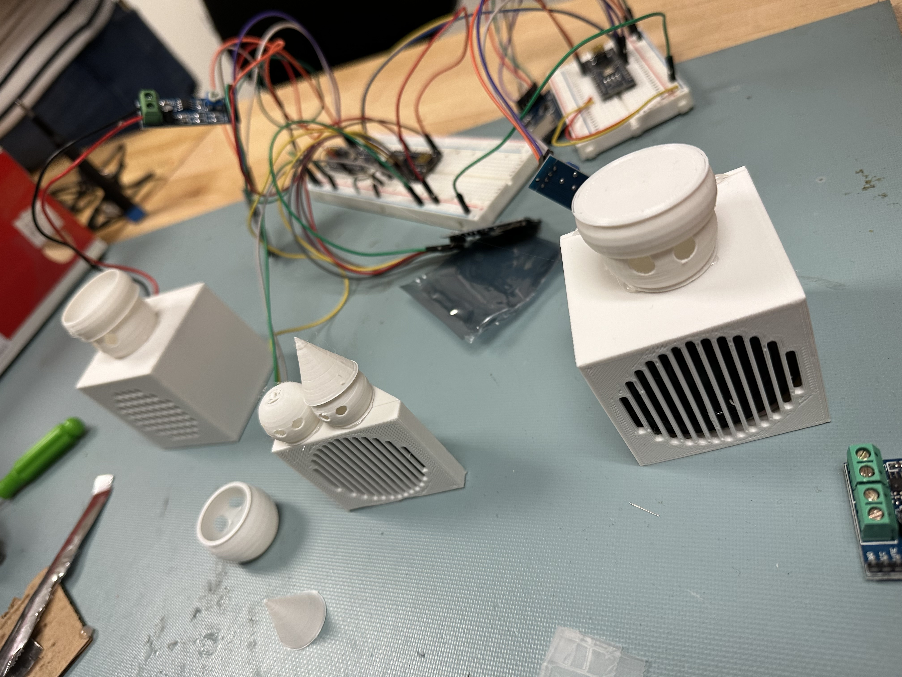
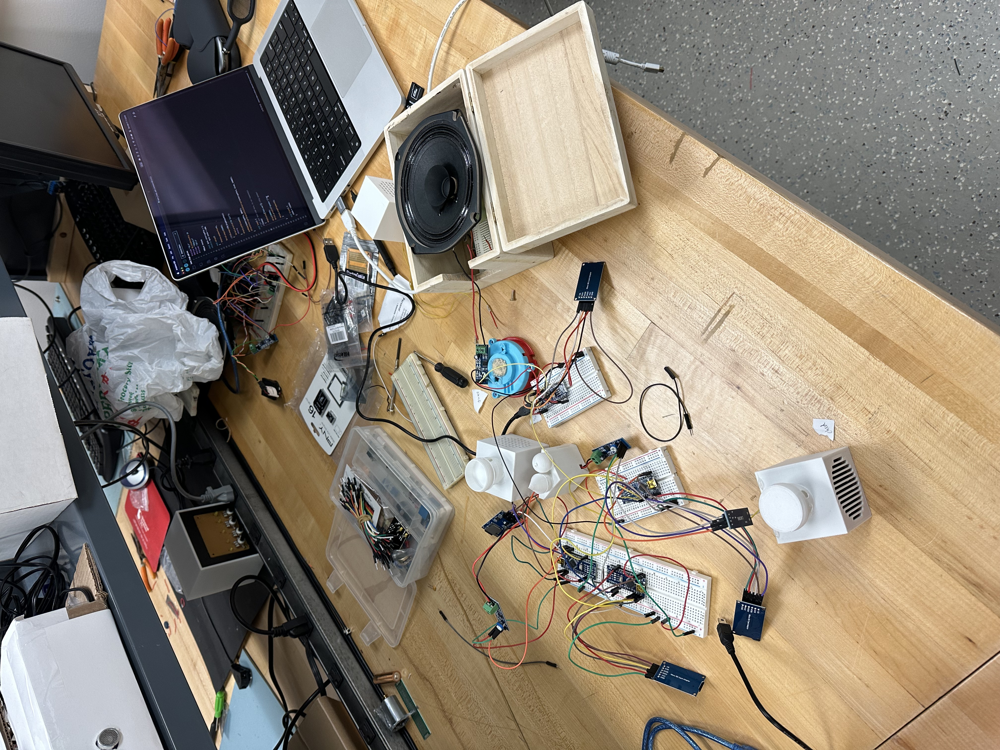

# Overview
- Arduino "sound art" project for "Embedded Systems and Kinetic Art" course
- Goal of project is to create a "robot choir", where each robot sings it's own melody and they all harmonize
- Inspiration taken from the Teenage Engineering Choir (https://teenage.engineering/products/choir)

# Resources
- https://www.youtube.com/watch?v=UN9XPWHamHw
- https://utah.instructure.com/courses/929060/files/159182288?wrap=1

# Setup
Order:
- Connect master arduino
- flash it
- connect the others
- press button for 3s on master then let go

# Media

